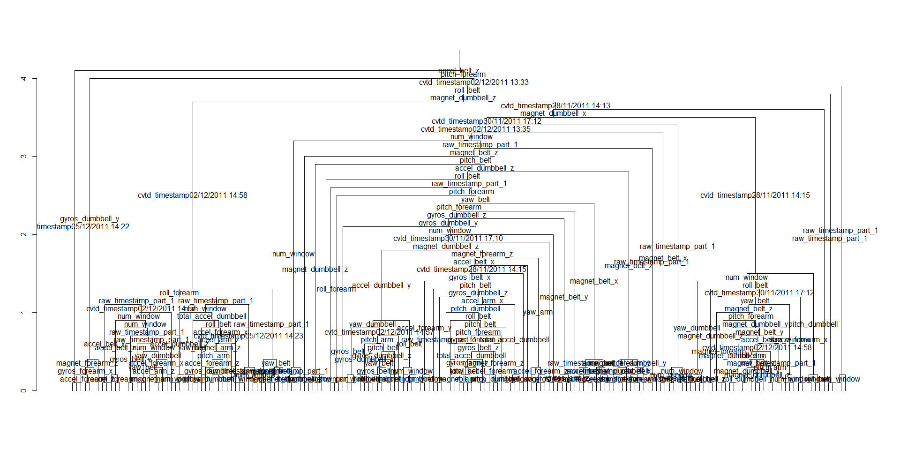

# Machine Learning - Final Project
Andre Morato  
10 de abril de 2017  


## R Markdown

## Introduction

In this report it will be applied some of techniques teached in class of Machine Learning. The goal of this project is to predict the manner in which they did the exercise. This is the "classe" variable in the training set.

### Background

Using devices such as Jawbone Up, Nike FuelBand, and Fitbit it is now possible to collect a large amount of data about personal activity relatively inexpensively. These type of devices are part of the quantified self movement - a group of enthusiasts who take measurements about themselves regularly to improve their health, to find patterns in their behavior, or because they are tech geeks. One thing that people regularly do is quantify how much of a particular activity they do, but they rarely quantify how well they do it. In this project, your goal will be to use data from accelerometers on the belt, forearm, arm, and dumbell of 6 participants. They were asked to perform barbell lifts correctly and incorrectly in 5 different ways. More information is available from the website here: http://groupware.les.inf.puc-rio.br/har (see the section on the Weight Lifting Exercise Dataset).

### Data

It was provided a training data for model development. The data for this project come from this source: http://groupware.les.inf.puc-rio.br/har.

Let's load the data and provide some basic information.


```r
## Loading used packages
library(caret)
data<-read.csv("pml-training.csv", header = TRUE, na.strings = c("","NA"))
dim(data)
```

```
## [1] 19622   160
```

```r
head(names(data))
```

```
## [1] "X"                    "user_name"            "raw_timestamp_part_1"
## [4] "raw_timestamp_part_2" "cvtd_timestamp"       "new_window"
```

```r
tail(names(data))
```

```
## [1] "accel_forearm_y"  "accel_forearm_z"  "magnet_forearm_x"
## [4] "magnet_forearm_y" "magnet_forearm_z" "classe"
```

It will be developed a model for predict the "classe" of activity. Let's see how each label of "classe" is distributed in data set.


```r
class(data$classe)
```

```
## [1] "factor"
```

```r
table(data$classe)
```

```
## 
##    A    B    C    D    E 
## 5580 3797 3422 3216 3607
```

There are five possible outcomes for the activity. The label "A" is the most frequent and the others ("B", "C", "D" and "E") have similar frequencies.

It will be a subset in data to remove variables which all measurements is equal to NA.


```r
## Finding the variables that contains NA
na <- NULL
for (i in 1:159){
  na<-c(na,sum(is.na(data[,i])))
}
cleandata <- data[,na==0]
dim(cleandata)
```

```
## [1] 19622    60
```

```r
sum(is.na(cleandata))
```

```
## [1] 0
```

The first two variables will be removed, so the only predictors will be the acelerometers measurement.


```r
cleandata<-cleandata[,-c(1,2)]
```


### Data partition

There are **57** variables and **19622** observations. It is a large sample size, so it is possible to apply testing and validation of proposed models. The following distribution will be applied.

- 60% training
- 20% testing
- 20% validation

The following code creates the training, testing and validation data sets.


```r
inTrain <- createDataPartition(y=cleandata$classe, p=0.6, list=FALSE)
training <- cleandata[inTrain,]
buildData <- cleandata[-inTrain,]

inTest <- createDataPartition(y=buildData$classe, p = 0.5, list=FALSE)
testing <- buildData[inTest,]
validation <- buildData[-inTest,]

dim(training)
```

```
## [1] 11776    58
```

```r
dim(testing)
```

```
## [1] 3923   58
```

```r
dim(validation)
```

```
## [1] 3923   58
```

### Model description

The chosen method is combining predictors. This approach tends to increase the accuracy. One major flop of this method is the reduction in interpretability.

The fisrt model chosen is a random forest. This model can be seen as a variation of combining predictors. The pros and cons are the same pointed for combining predictors approach.

The random forest method is applied with cross validation K-fold type. The number of folds is 10, that is the standard when choosing cross validation in caret package. The code below create the first model.


```
## Warning: package 'randomForest' was built under R version 3.3.3
```

```
## Random Forest 
## 
## 11776 samples
##    57 predictor
##     5 classes: 'A', 'B', 'C', 'D', 'E' 
## 
## No pre-processing
## Resampling: Cross-Validated (10 fold) 
## Summary of sample sizes: 10600, 10598, 10600, 10597, 10598, 10599, ... 
## Resampling results across tuning parameters:
## 
##   mtry  Accuracy   Kappa    
##    2    0.9902362  0.9876485
##   38    0.9993210  0.9991412
##   75    0.9983869  0.9979596
## 
## Accuracy was used to select the optimal model using  the largest value.
## The final value used for the model was mtry = 38.
```

This model achieved a very high accurace in training set. The accuracy is 99.8%. The in sample error rate is 0.2%.

This could be a sign of overfitting. A perfect in sample predictor predict both signal and noise of data. So, it is expected a not so good performance in new sample.

Let's evaluate this model in test data.


```r
pred1 <- predict(mod1, testing)
confusionMatrix(pred1, testing$classe)
```

```
## Confusion Matrix and Statistics
## 
##           Reference
## Prediction    A    B    C    D    E
##          A 1116    1    0    0    0
##          B    0  758    2    0    0
##          C    0    0  680    0    0
##          D    0    0    2  643    0
##          E    0    0    0    0  721
## 
## Overall Statistics
##                                          
##                Accuracy : 0.9987         
##                  95% CI : (0.997, 0.9996)
##     No Information Rate : 0.2845         
##     P-Value [Acc > NIR] : < 2.2e-16      
##                                          
##                   Kappa : 0.9984         
##  Mcnemar's Test P-Value : NA             
## 
## Statistics by Class:
## 
##                      Class: A Class: B Class: C Class: D Class: E
## Sensitivity            1.0000   0.9987   0.9942   1.0000   1.0000
## Specificity            0.9996   0.9994   1.0000   0.9994   1.0000
## Pos Pred Value         0.9991   0.9974   1.0000   0.9969   1.0000
## Neg Pred Value         1.0000   0.9997   0.9988   1.0000   1.0000
## Prevalence             0.2845   0.1935   0.1744   0.1639   0.1838
## Detection Rate         0.2845   0.1932   0.1733   0.1639   0.1838
## Detection Prevalence   0.2847   0.1937   0.1733   0.1644   0.1838
## Balanced Accuracy      0.9998   0.9990   0.9971   0.9997   1.0000
```

Surprisingly, it can be seen an almost perfect prediction in test set. The accuracy is **99.87**. The out of sample error rate is **0.13**.

The expectation of a bad performance in new data was not confirmed. This good result in test set allow us to don't make changes in model before check it in validation data.

Now, let's check the model with in validation data.


```r
valid1 <- predict(mod1, validation)
confusionMatrix(valid1, validation$classe)
```

```
## Confusion Matrix and Statistics
## 
##           Reference
## Prediction    A    B    C    D    E
##          A 1116    2    0    0    0
##          B    0  754    0    0    0
##          C    0    3  681    0    0
##          D    0    0    3  643    0
##          E    0    0    0    0  721
## 
## Overall Statistics
##                                          
##                Accuracy : 0.998          
##                  95% CI : (0.996, 0.9991)
##     No Information Rate : 0.2845         
##     P-Value [Acc > NIR] : < 2.2e-16      
##                                          
##                   Kappa : 0.9974         
##  Mcnemar's Test P-Value : NA             
## 
## Statistics by Class:
## 
##                      Class: A Class: B Class: C Class: D Class: E
## Sensitivity            1.0000   0.9934   0.9956   1.0000   1.0000
## Specificity            0.9993   1.0000   0.9991   0.9991   1.0000
## Pos Pred Value         0.9982   1.0000   0.9956   0.9954   1.0000
## Neg Pred Value         1.0000   0.9984   0.9991   1.0000   1.0000
## Prevalence             0.2845   0.1935   0.1744   0.1639   0.1838
## Detection Rate         0.2845   0.1922   0.1736   0.1639   0.1838
## Detection Prevalence   0.2850   0.1922   0.1744   0.1647   0.1838
## Balanced Accuracy      0.9996   0.9967   0.9973   0.9995   1.0000
```

Again, it can be seen an almost perfect prediction in validation set too. The accuracy is **99.8**. The out of sample error rate is **0.2**.

The expectation of a bad performance in new data was not confirmed again. This good result in validation set allow us to abort the planned strategy and adopt this random forest model for predict the test set provided.

### Prediction of 20 test cases

Now, we will predict the "classe" of 20 test cases.


```r
## Loading test set
testset<-read.csv("pml-testing.csv", header = TRUE, na.strings = c("","NA"))
dim(testset)
```

```
## [1]  20 160
```

```r
cleantest <- testset[,na==0]
dim(cleantest)
```

```
## [1] 20 60
```

```r
sum(is.na(cleantest))
```

```
## [1] 0
```

```r
cleantest<-cleantest[,-c(1,2)]

## Prediction with the model
finalpred <- predict(mod1, cleantest)
finalpred
```

```
##  [1] B A B A A E D B A A B C B A E E A B B B
## Levels: A B C D E
```

**All predictions are correct! It was verified in the quiz.**


The following code will generate a illustration of the top of decision tree corresponding to the model created. This code was obtaind in http://stats.stackexchange.com/questions/2344/best-way-to-present-a-random-forest-in-a-publication


```r
to.dendrogram <- function(dfrep,rownum=1,height.increment=0.1){

  if(dfrep[rownum,'status'] == -1){
    rval <- list()

    attr(rval,"members") <- 1
    attr(rval,"height") <- 0.0
    attr(rval,"label") <- dfrep[rownum,'prediction']
    attr(rval,"leaf") <- TRUE

  }else{##note the change "to.dendrogram" and not "to.dendogram"
    left <- to.dendrogram(dfrep,dfrep[rownum,'left daughter'],height.increment)
    right <- to.dendrogram(dfrep,dfrep[rownum,'right daughter'],height.increment)
    rval <- list(left,right)

    attr(rval,"members") <- attr(left,"members") + attr(right,"members")
    attr(rval,"height") <- max(attr(left,"height"),attr(right,"height")) + height.increment
    attr(rval,"leaf") <- FALSE
    attr(rval,"edgetext") <- dfrep[rownum,'split var']
    #To add Split Point in Dendrogram
    #attr(rval,"edgetext") <- paste(dfrep[rownum,'split var'],"\n<",round(dfrep[rownum,'split point'], digits = 2),"=>", sep = " ")
  }

  class(rval) <- "dendrogram"

  return(rval)
}

tree <- getTree(mod1$finalModel,1,labelVar=TRUE)

d <- to.dendrogram(tree)
## str(d)
plot(d,center=TRUE,leaflab='none',edgePar=list(t.cex=1,p.col=NA,p.lty=0))
```


